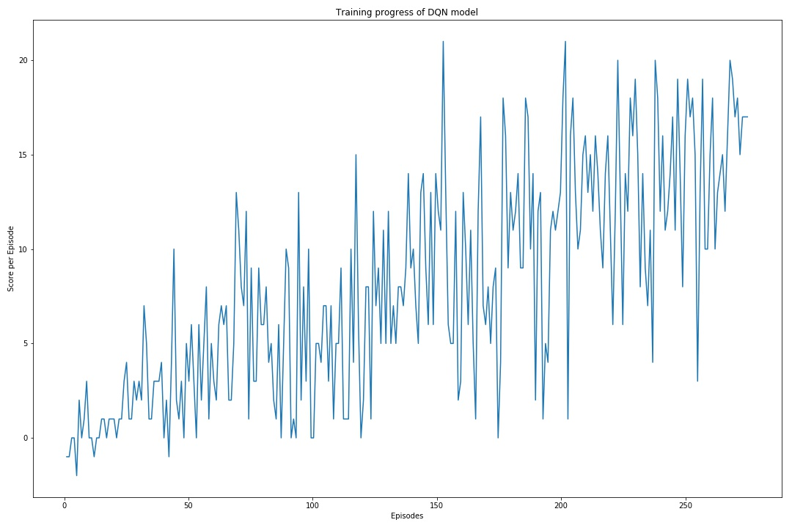

# Project report

## Deep Q-Learning algorithm implementation details

The RL algorithm used is Deep Q Learning with *Fixed Q-targets* and *random experience replay* as described in [original paper](https://storage.googleapis.com/deepmind-media/dqn/DQNNaturePaper.pdf).
But the input is not an image and so fully connected layers are used instead of convolutional layers. The details of the network is provided below:

- Fully connected layer - input: 37 (state size) output: 64 activation : Relu
- Fully connected layer - input: 64 output 64 activation : Relu
- Fully connected layer - input: 64 output: 4 (action size) 

The above model is defined using Pytorch.

Q-model training parameters:

- batch size = 64  
- Optimizer : Adam
- Learning rate = 5e-4
- Loss : MSE

RL training parameters:

- BUFFER_SIZE = int(1e4)  # replay buffer size
- BATCH_SIZE = 64         # minibatch size
- GAMMA = 0.99            # discount factor
- TAU = 1e-3              # for soft update of target parameters
- LR = 5e-4               # learning rate 
- UPDATE_EVERY = 4        # how often to update the network


## Results

### Training Plot
Plot showing the RL training with respect to average rewards over last 100 episodes. 


### Training Output
```
Episode 100	Average Score: 3.34	epsilon: 0.04755
Episode 200	Average Score: 8.41	epsilon: 0.00500
Episode 274	Average Score: 13.09
Environment solved in 274 episodes!	Average Score: 13.09
```

## Ideas for future work

1. Extensive hyperparameter optimization
2. Prioritized Experience Replay
3. Dueling Deep Q Networks
